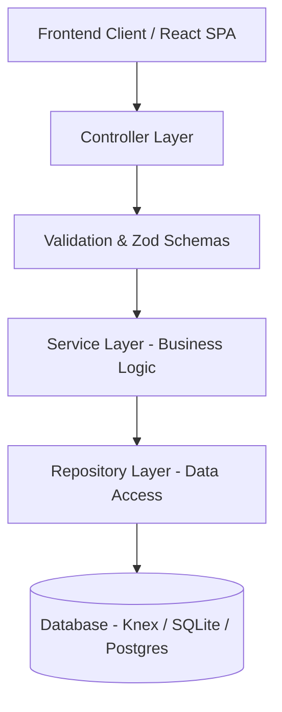
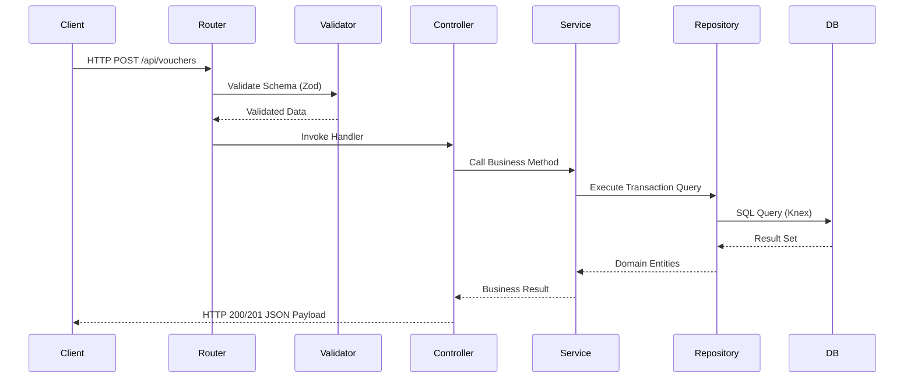
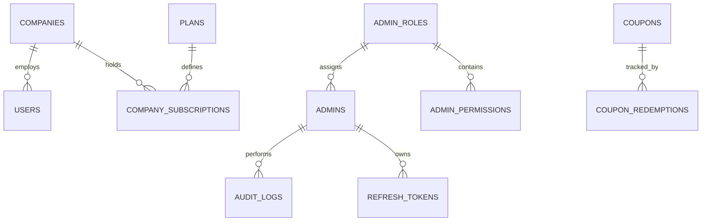
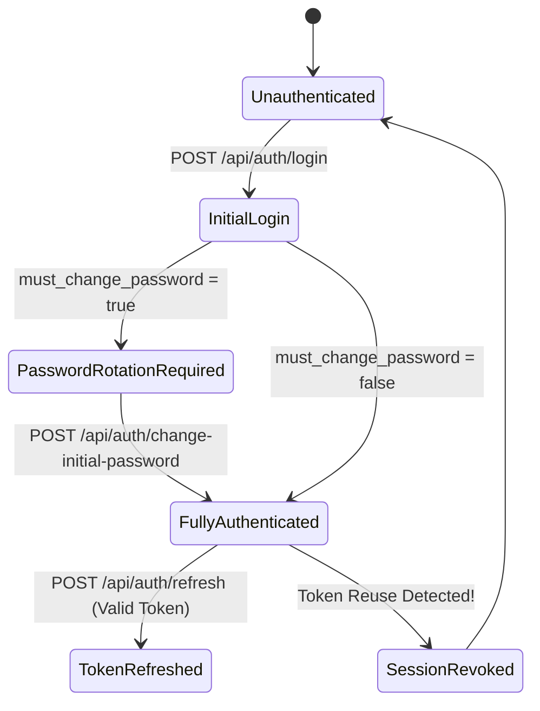
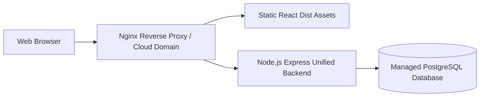

# BRAIN.md — SARFIS ERP System Architecture & Technical Master Record

> **Single Source of Truth (SSOT)** for the SARFIS Smart Accounting & Real-time Financial Intelligence System.
> 
> *This document serves as the permanent project brain, architectural blueprint, and technical reference for all engineers, solution architects, and AI assistants working on SARFIS.*

---

## Table of Contents
1. [Project Overview](#1-project-overview)
2. [Core Design Principles](#2-core-design-principles)
3. [Technology Stack](#3-technology-stack)
4. [Project Folder Structure](#4-project-folder-structure)
5. [Backend Architecture](#5-backend-architecture)
6. [Database Architecture](#6-database-architecture)
7. [Authentication Architecture](#7-authentication-architecture)
8. [Authorization Model (RBAC)](#8-authorization-model-rbac)
9. [Multi-Tenant & Workspace Architecture](#9-multi-tenant--workspace-architecture)
10. [ERP Core Modules](#10-erp-core-modules)
11. [SaaS Control & Platform Administration](#11-saas-control--platform-administration)
12. [API Standards & Conventions](#12-api-standards--conventions)
13. [Security & Compliance Standards](#13-security--compliance-standards)
14. [Logging, Observability & Health Probes](#14-logging-observability--health-probes)
15. [Development & Migration Workflow](#15-development--migration-workflow)
16. [Coding Standards & Conventions](#16-coding-standards--conventions)
17. [Performance & Scalability Guidelines](#17-performance--scalability-guidelines)
18. [Deployment & Infrastructure Architecture](#18-deployment--infrastructure-architecture)
19. [Future Architectural Roadmap](#19-future-architectural-roadmap)
20. [Strict Development Rules](#20-strict-development-rules)
21. [AI Assistant Rules & Directives](#21-ai-assistant-rules--directives)
22. [Glossary of Terms](#22-glossary-of-terms)

---

## 1. Project Overview

### 1.1 What is SARFIS?
**SARFIS** (Smart Accounting & Real-time Financial Intelligence System) is a modern, enterprise-grade, multi-tenant SaaS ERP platform designed to unify financial accounting, human resource management, payroll processing, fixed asset lifecycle tracking, inventory management, purchasing workflows, and executive analytics into a single cohesive ecosystem.

### 1.2 Business Purpose
The primary purpose of SARFIS is to enable mid-market and enterprise organizations to transition from fragmented, error-prone legacy accounting systems to an automated, auditable, and real-time financial intelligence platform. SARFIS eliminates double-entry overhead, prevents unauthorized journal adjustments, enforces multi-tier approval hierarchies, and provides real-time auditability.

### 1.3 ERP Philosophy (UX-First Enterprise)
SARFIS adheres strictly to the **UX-First Enterprise Philosophy**:
- **Intuitive First, Enterprise Second, Technical Third**: Primary workflows must be understandable by accountants, HR managers, and business executives without technical training (the "Grandmother Test").
- **3-Click Efficiency Rule**: Frequently executed operations (e.g., approving a voucher, viewing employee payslips, releasing payments) must never require more than three user interactions.
- **Progressive Disclosure**: Primary interfaces render high-level business status, totals, and primary call-to-action buttons. Advanced technical details (JSON audit traces, ledger formula evaluation, raw API payloads) are accessible on-demand via expandable drawers and sub-views.
- **Card-First Responsive Design**: Interfaces adapt gracefully across Desktop (Tables + Summary Cards), Tablet (Compact Cards), and Mobile (Card Views with touch targets).

### 1.4 Target Audience
1. **Financial Controllers & Accountants**: Require real-time general ledger balances, automated bank reconciliation, trial balance validation, and audit-proof journal entries.
2. **HR Officers & Payroll Managers**: Require automated salary structure computation, tax/deduction management, attendance tracking, and one-click payroll posting.
3. **Inventory & Warehouse Managers**: Require stock receipt tracking, multi-warehouse transfers, valuation reports (FIFO/Weighted Average), and reorder alerts.
4. **SaaS Platform Administrators**: Require cross-tenant oversight, subscription plan enforcement, promotional coupon management, user blocking, and system health telemetry.

---

## 2. Core Design Principles

SARFIS is engineered around strict software engineering paradigms to ensure maintainability, testability, security, and long-term scalability.



### 2.1 Clean Architecture & Layered Separation
The codebase strictly separates presentation, business logic, data access, and infrastructure concerns:
- **Controllers**: Handle HTTP request extraction, status code mapping, and response formatting. **Controllers NEVER contain business logic or raw SQL queries.**
- **Services**: Enforce domain rules, workflow transitions, calculation engines, and cross-repository orchestrations.
- **Repositories**: Encapsulate all database interaction logic using Knex query builder.
- **Validators**: Enforce schema constraints (Zod) prior to executing service logic.

### 2.2 SOLID Principles
- **Single Responsibility Principle (SRP)**: Each service or controller handles exactly one domain responsibility (e.g., `PayrollService` computes payroll; `VoucherService` manages voucher lifecycles).
- **Open/Closed Principle (OCP)**: Workflows and reporting engines are extensible via module interfaces without mutating core calculation routines.
- **Liskov Substitution Principle (LSP)**: Database client abstractions support seamless dynamic substitution between SQLite3 (Local Dev) and PostgreSQL (Production).
- **Interface Segregation Principle (ISP)**: Endpoints consume specialized, decoupled request DTOs rather than monolithic payloads.
- **Dependency Inversion Principle (DIP)**: High-level business logic relies on repository abstractions rather than concrete DB drivers.

### 2.3 Key Operational Mantras
- **DRY (Don't Repeat Yourself)**: Shared utilities (e.g., financial rounding, date formatting, JWT verification) are centralized in core utility modules.
- **KISS (Keep It Simple, Stupid)**: Prefer straightforward, readable business code over overly complex meta-programming.
- **YAGNI (You Aren't Gonna Need It)**: Implement clean, extensible features for verified requirements without introducing dead abstractions.
- **Security-First**: Enforce strict input validation, authorization checks, parameter sanitization, and output encoding by default.

---

## 3. Technology Stack

SARFIS utilizes a modern, battle-tested JavaScript/Node.js stack tailored for performance and operational resilience.

| Layer | Technology | Selection Rationale |
| :--- | :--- | :--- |
| **Frontend Framework** | **React (Vite)** | Lightning-fast HMR, component modularity, dynamic SPA routing, optimized production bundle size. |
| **Frontend Styling** | **Tailwind CSS + Vanilla CSS** | Utility-first CSS providing pixel-perfect design tokens, responsive breakpoints, sleek dark mode aesthetics. |
| **State Management** | **Zustand** | Lightweight, boilerplate-free state management for authentication, company contexts, and dynamic UI state. |
| **Icons & Micro-UI** | **Lucide React** | Consistent, modern vector iconography with full accessibility label support. |
| **Backend Runtime** | **Node.js (Express)** | Non-blocking I/O event loop suitable for concurrent API handling, micro-services, and streaming. |
| **Query Builder / ORM** | **Knex.js** | SQL query builder providing raw query control, migration execution, and driver-agnostic support. |
| **Database (Dev)** | **SQLite3** | Zero-configuration file-based database for rapid local development and automated testing. |
| **Database (Prod)** | **PostgreSQL** | Enterprise-grade transactional relational database with full ACID compliance, JSONB support, and SSL. |
| **Authentication** | **JWT + Refresh Tokens** | Stateless 15-minute access token validation with persistent 7-day refresh token rotation. |
| **Validation** | **Zod** | Type-safe runtime schema validation for request payloads and query parameters. |
| **Security Headers** | **Helmet** | Protects against well-known web vulnerabilities (clickjacking, MIME sniffing, XSS). |
| **Rate Limiting** | **express-rate-limit** | Prevents brute-force credential stuffing and API abuse via IP rate limiting windows. |
| **Container / Hosting** | **Railway / Docker / VPS** | Automated Git-triggered cloud deployment with SSL, dynamic domain routing, and environment secrets. |

---

## 4. Project Folder Structure

The SARFIS workspace is organized into clear, decoupled top-level directories:

```
sarfis/
├── backend/                  # Main SARFIS ERP Core API (Port 5001 / Cloud)
│   ├── src/
│   │   ├── config/           # Database & environment secrets configuration
│   │   ├── controllers/      # HTTP request handlers
│   │   ├── db/               # Knex migrations and master seeds
│   │   ├── middleware/       # JWT auth, multi-company context, rate limiting
│   │   ├── models/           # Domain data interfaces & helper schemas
│   │   ├── repositories/     # Data access abstraction layer
│   │   ├── routes/           # Express endpoint router definitions
│   │   ├── services/         # Business domain & workflow logic
│   │   └── utils/            # SHA-256 crypto, date, and math helpers
│   ├── server.js             # Backend entry point & migration bootstrap
│   └── package.json
│
├── saas-admin-backend/       # Platform Admin Control API (Port 3000 / Sub-App)
│   ├── src/
│   │   ├── config/           # Secret strength & environment validator
│   │   ├── controllers/      # Admin auth, user block, coupon management
│   │   ├── db/               # Dedicated SaaS Admin migrations & seeds
│   │   ├── errors/           # Operational AppError classes
│   │   ├── middleware/       # Admin RBAC & Audit logger
│   │   ├── repositories/     # SaaS control data access
│   │   ├── routes/           # Admin API endpoint routes
│   │   ├── services/         # Audit chaining, coupon engine, session revocation
│   │   └── validators/       # Zod schemas for admin operations
│   └── knexfile.js
│
├── frontend/                 # React SPA (Vite / Port 5173)
│   ├── src/
│   │   ├── assets/           # Dynamic imagery & vector graphics
│   │   ├── components/       # Reusable UI cards, tables, drawers, banners
│   │   ├── pages/            # Page view controllers (ERP & SaaS Control)
│   │   ├── services/         # Axios API clients & interceptors
│   │   ├── store/            # Zustand global stores (Auth, Company, Theme)
│   │   ├── utils/            # Exporter helpers (PDF, Excel, CSV)
│   │   ├── App.jsx           # Master route configuration
│   │   └── main.jsx          # React DOM entry point
│   └── vite.config.js
│
├── BRAIN.md                  # Project Technical Master Record
└── package.json              # Monorepo orchestration scripts
```

---

## 5. Backend Architecture

### 5.1 Repository-Service-Controller Pattern

SARFIS backend services follow a strict 4-stage processing pipeline:



1. **Request Reception & Routing**: Express routes receive incoming HTTP requests and pass them through security middleware.
2. **Validation**: Requests pass through Zod validators before entering controllers. Invalid payloads return HTTP 400 immediately.
3. **Controller Execution**: Extracts request params, headers, and validated body. Calls domain service methods. Formats standard HTTP responses.
4. **Service Execution**: Handles business rules, permission logic, state transitions, ledger postings, and audit logging.
5. **Repository Execution**: Constructs Knex database queries, manages SQL transactions, and returns domain objects.

---

## 6. Database Architecture

### 6.1 Database Strategy (Development vs. Production)
- **Local Development**: SQLite3 (`saas_admin.sqlite3` / `sarfis.sqlite3`) for zero-overhead local development.
- **Cloud Production**: PostgreSQL (`pg`) connected via `DATABASE_URL` with SSL support (`rejectUnauthorized: false` for managed Railway/cloud Postgres).

### 6.2 Key Relational Schemas



### 6.3 Database Standards
- **Naming Conventions**: Snake_case for table names and column names (`company_id`, `created_at`, `must_change_password`).
- **Primary Keys**: Numeric auto-incrementing integer IDs (`id`) for lookup performance, or UUID strings (`id`) for globally unique entities.
- **Foreign Keys**: Explicit foreign key constraints with cascaded deletion (`onDelete('CASCADE')`) or safe nullification (`onDelete('SET NULL')`).
- **Soft Deletes**: Critical master records (Users, Accounts, Companies) utilize status fields (`ACTIVE`, `BLOCKED`, `SUSPENDED`, `DELETED`) rather than hard SQL deletions.
- **Indexes**: Indexes are placed on foreign keys, lookups (`email`, `code`, `token_hash`), and filter combinations (`[status, role]`).

---

## 7. Authentication Architecture

SARFIS features a production-hardened dual-token authentication gateway with mandatory initial password rotation and token family reuse detection.



### 7.1 Key Auth Components
1. **Access Tokens (JWT)**: Short-lived (15 minutes). Signed with `JWT_ACCESS_SECRET`. Contains `admin_id`, `email`, `role`, and `scope` (`CHANGE_PASSWORD_ONLY` vs `FULL_ACCESS`).
2. **Refresh Tokens**: Long-lived (7 days). Stored as SHA-256 hashes in `refresh_tokens`.
3. **Token Family Reuse Detection**: Refresh tokens belong to a `family_id`. If an expired or previously used refresh token is presented, SARFIS revokes the entire token family and terminates all active sessions for that administrator.
4. **Mandatory Password Rotation**: Newly created administrator accounts are flagged with `must_change_password = true`. The JWT scope restricts access exclusively to `/change-initial-password` until rotated.

---

## 8. Authorization Model (RBAC)

SARFIS enforces multi-tier Role-Based Access Control (RBAC):

| Role | Access Level & Description |
| :--- | :--- |
| **SUPER_ADMIN** | Unconstrained master access to all tenants, user management, coupons, subscriptions, audit logs, and diagnostic probes. |
| **ADMIN** | Standard platform management (User blocking, coupon generation, subscription view). Excludes administrative deletion. |
| **SUPPORT** | Customer support access with read-only views and user blocking capabilities. |
| **READ_ONLY** | Telemetry and reporting access without mutation rights. |

```javascript
// RBAC Middleware Enforcement Example
const checkPermission = (requiredPermission) => {
  return (req, res, next) => {
    if (req.admin.role === 'SUPER_ADMIN') return next();
    if (!req.admin.permissions.includes(requiredPermission)) {
      throw new AppError('Access forbidden. Required permission missing.', 403, 'FORBIDDEN');
    }
    next();
  };
};
```

---

## 9. Multi-Tenant & Workspace Architecture

SARFIS implements a **Shared Database, Multi-Tenant Schema** architecture:
- Every operational table includes a `company_id` foreign key.
- **Tenant Context Interceptor**: Requests pass through `tenantContextMiddleware`, which inspects the `x-company-id` header and injects `req.companyId`.
- **Query Scoping**: All database repository queries automatically append `.where({ company_id: req.companyId })` to prevent cross-tenant data leakage.

---

## 10. ERP Core Modules

SARFIS includes 15 integrated modules:

1. **Executive Dashboard**: Real-time financial metrics, cash flow charts, KPI cards, pending approval queues.
2. **General Ledger & Accounting**: Chart of Accounts, journal vouchers, trial balance, balance sheet, P&L statement.
3. **Accounts Receivable & Sales**: Customer registry, sales orders, invoices, payment receipts.
4. **Accounts Payable & Purchasing**: Vendor registry, purchase requisitions, purchase orders, goods receipt notes (GRN), vendor bills.
5. **Inventory Management**: Stock items, multi-warehouse locations, stock movements, stock valuation (FIFO/Weighted Avg).
6. **Payroll & Human Resources**: Employee 360° workspace, salary structures, payslip generator, tax computations, automated ledger posting.
7. **Fixed Assets**: Asset registry, depreciation schedules (Straight Line / Declining Balance), asset disposals.
8. **Budgeting & Variance Analysis**: Fiscal budgets, department allocations, real-time budget vs. actual variance tracking.
9. **Multi-Currency & Exchange Engine**: Real-time currency conversions, unrealized/realized gain/loss calculation.
10. **Period-Close Engine**: Accounting period locking, year-end roll-forward entries, audit locks.
11. **Communication & Workspace Feed**: Cross-department notes, voucher approval comments, internal messaging.
12. **Risk & Internal Audit**: Audit trail review, anomaly detection alerts, compliance verification.
13. **Financial Notes & Exporter**: Printable PDF/Excel generation, financial statement footnote builder.
14. **System Settings & Rules**: Company setup, fiscal year definition, default account assignments.
15. **SaaS Control Panel**: Cross-tenant platform administration.

---

## 11. SaaS Control & Platform Administration

The **SaaS Control Panel** (`/saas-control`) operates as an enterprise management dashboard:
- **Tenant Registry**: Provision, inspect, suspend, or reactivate companies.
- **User Management**: Search user accounts across all companies, block/unblock violators, inspect login frequencies.
- **Promotional Coupons**: Generate percentage or fixed-value discount coupons with usage limits and expiration dates.
- **Tamper-Evident Audit Trail**: View SHA-256 hash-chained audit events for every administrative action.
- **System Telemetry**: Real-time Node.js heap usage, RSS memory, uptime, database connectivity, and readiness probes.

---

## 12. API Standards & Conventions

SARFIS API endpoints follow strict RESTful conventions:

### 12.1 Standard HTTP Response Envelope
```json
{
  "success": true,
  "message": "Resource created successfully.",
  "data": {
    "id": 1024,
    "code": "VOUCH-2026-001",
    "amount": 4900.00
  }
}
```

### 12.2 Standard Error Response Envelope
```json
{
  "success": false,
  "error": "VALIDATION_ERROR",
  "message": "Validation failed: discount_value cannot exceed 100%",
  "details": [
    {
      "field": "discount_value",
      "message": "Percentage discount value cannot exceed 100%"
    }
  ]
}
```

### 12.3 Standard HTTP Status Codes
- `200 OK`: Successful read or update operation.
- `201 Created`: Successful creation operation.
- `400 Bad Request`: Validation failure or business rule rejection.
- `401 Unauthorized`: Missing, invalid, or expired JWT.
- `403 Forbidden`: Insufficient RBAC permissions or mandatory password change required.
- `404 Not Found`: Resource does not exist.
- `429 Too Many Requests`: Rate limit window exceeded.
- `500 Internal Server Error`: Unhandled server exception.

---

## 13. Security & Compliance Standards

1. **Password Hashing**: Passwords are hashed using `bcryptjs` with a cost factor of 10. Raw passwords are NEVER logged or stored.
2. **Tamper-Evident Audit Logging**: Every administrative action generates a SHA-256 hash chaining link (`record_hash = SHA256(previous_hash + payload)`). Any modification to past audit records breaks the hash chain.
3. **Brute-Force & Rate Limiting**: Endpoint rate limiting (`express-rate-limit`) limits IP requests.
4. **SQL Injection Protection**: All queries utilize parameterized Knex query bindings. Raw SQL strings are strictly prohibited unless parameterized via `whereRaw('LOWER(email) = ?', [email])`.
5. **Security Headers**: `helmet` sanitizes HTTP headers, disables `x-powered-by`, and enforces frameguard protections.

---

## 14. Logging, Observability & Health Probes

SARFIS provides 3 diagnostic endpoints:
- **`GET /live`**: Pure process liveness probe. Returns HTTP 200 `{ status: 'ALIVE' }` with process uptime.
- **`GET /ready`**: Readiness probe. Executes `SELECT 1` on the database to verify live DB connectivity before routing traffic.
- **`GET /health`**: Diagnostic telemetry. Returns heap usage, RSS memory, active node version, and database connection status (Authenticated).

---

## 15. Development & Migration Workflow

### 15.1 Monorepo Commands
Root monorepo commands in `package.json`:
- `npm run install-all`: Installs dependencies across `backend`, `saas-admin-backend`, and `frontend`.
- `npm run build`: Executes `install-all` and builds the production React Vite frontend bundle.
- `npm run dev`: Runs backend and frontend development servers concurrently.
- `npm test`: Runs the automated test suite in `saas-admin-backend/tests/api.test.js`.

### 15.2 Database Migration Standard
New database schema modifications MUST be executed via Knex migrations:
```bash
# Create a new migration in saas-admin-backend
npx knex migrate:make add_custom_field_to_companies --migrations-directory src/db/migrations
```

---

## 16. Coding Standards & Conventions

1. **File Naming**:
   - React Components: PascalCase (`SaaSAdminDashboard.jsx`, `VoucherDetails.jsx`).
   - Controllers, Services, Repositories: camelCase (`authController.js`, `userService.js`, `auditLogRepository.js`).
   - Database Migrations: Timestamp prefix (`20260724000000_init_saas_admin_tables.js`).
2. **Variable Naming**:
   - JavaScript code: camelCase (`loginEmail`, `mustChangePassword`).
   - Database columns & payload keys: snake_case (`company_id`, `created_at`).
3. **Async Handling**: All async functions MUST use `async/await` with explicit `try/catch` blocks or express error middleware delegation (`next(err)`).

---

## 17. Performance & Scalability Guidelines

1. **Database Indexing**: All foreign keys, status columns, unique codes, and timestamp columns used in filtering MUST be indexed in migrations.
2. **Pagination & Virtualization**: API list endpoints MUST support `page` and `limit` query parameters (default `limit=50`). Large datasets in frontend tables must utilize virtualization or pagination.
3. **Memory Optimization**: Avoid loading entire database tables into Node.js process memory. Use `.select()` to extract only necessary columns.

---

## 18. Deployment Architecture



- **Environment**: Hostinger VPS / Railway / Docker.
- **Reverse Proxy**: Nginx routes incoming HTTPS traffic to port `5001` (Backend API) and serves static frontend build assets from `/frontend/dist`.
- **Process Manager**: PM2 manages Node.js cluster mode, automatic server restarts on crash, and log rotation.

---

## 19. Future Architectural Roadmap

- [ ] **Multi-Factor Authentication (MFA/TOTP)**: Integration of authenticator app TOTP verification.
- [ ] **Enterprise SSO (SAML 2.0 / SCIM)**: Single Sign-On integration for Okta, Azure AD, and Google Workspace.
- [ ] **Redis Caching & Session Storage**: High-speed caching for general ledger summary balances and user session validation.
- [ ] **Asynchronous Message Queue (BullMQ / RabbitMQ)**: Background processing for heavy PDF export jobs, automated email dispatch, and scheduled reports.
- [ ] **AI Assistant & Predictive Financial Intelligence**: Semantic AI assistant for natural language ledger queries, variance analysis, and cash flow forecasting.

---

## 20. Strict Development Rules

> ⚠️ **MANDATORY RULES FOR ALL DEVELOPERS & AI AGENTS. NO EXCEPTIONS.**

1. **NEVER access the database directly from Controllers.** All data queries MUST pass through Services and Repositories.
2. **NEVER hardcode secrets, passwords, or API keys in source files.** Read all secrets from `process.env`.
3. **ALWAYS use parameterized queries.** Raw unparameterized SQL concatenation is strictly forbidden.
4. **EVERY schema change MUST have a Knex migration.** Manual database modifications are prohibited.
5. **EVERY API request MUST be validated.** Use Zod schemas before processing payloads.
6. **NEVER display raw system stack traces to end-users.** Catch errors and return sanitized business messages via `AppError`.
7. **ALWAYS enforce multi-company isolation.** Every ERP query must filter by `company_id`.
8. **NEVER delete or disable unit tests.** Fix the underlying implementation contract instead.

---

## 21. AI Assistant Rules & Directives

> 🤖 **SPECIAL DIRECTIVES FOR AI ASSISTANTS (Gemini / Antigravity / Codex)**

1. **Inspect Before Mutating**: NEVER guess variable names, file paths, or proto/database definitions. Always view the source file first.
2. **Preserve Architectural Patterns**: Adhere strictly to the Repository-Service-Controller pattern, Zod validation, and established response envelopes.
3. **Run Tests After Code Modifications**: Always execute `npm test` or specific integration scripts after editing backend logic.
4. **Use Hyperlinks in Responses**: Create clickable `file://` markdown links for all modified files and symbols.
5. **Adhere to UX-First Enterprise Rules**: Ensure all new screens answer "What should the user do next?", enforce the 3-click rule, and use business-friendly terminology.

---

## 22. Glossary of Terms

- **Company / Tenant**: An isolated business entity operating within the SARFIS ERP platform.
- **Master Admin**: A platform administrator with full cross-tenant system access (`SUPER_ADMIN`).
- **Journal Voucher**: An accounting entry used to record financial transactions in the General Ledger.
- **Payslip**: A detailed breakdown of an employee's earnings, deductions, and net pay for a specific period.
- **Refresh Token Family**: A cryptographically linked sequence of refresh tokens used to detect unauthorized session hijacking.
- **Tamper-Evident Hash Chain**: A cryptographic sequence where each audit log entry embeds the SHA-256 hash of the preceding entry.
